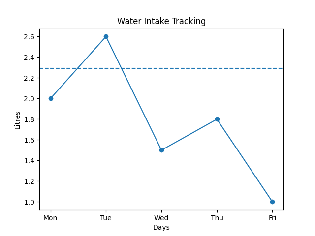
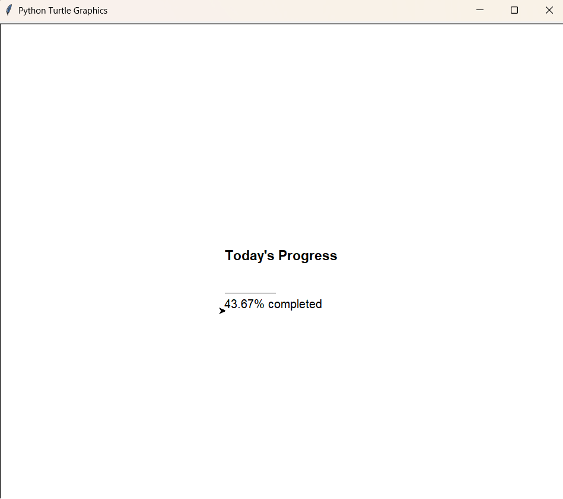

# Daily Water Intake Predictor

## Problem
Many people do not maintain proper hydration habits and often forget to track their daily water intake.

## Solution
This project predicts daily water intake based on weight, temperature, and activity level. It also tracks past water consumption and visualizes the data.

## Features
- Predicts water intake using simple AI logic
- Tracks 5-day water consumption
- Graph visualization using matplotlib
- Turtle-based progress display

## Tech Stack
Python, Matplotlib, Turtle

## How to Run
1. Install dependencies:
   pip install -r requirements.txt
2. Run:
   python main.py

## Output

### Graph

### Turtle Output

## Future Improvements
- Add reminders
- Improve UI
- Use real ML model
